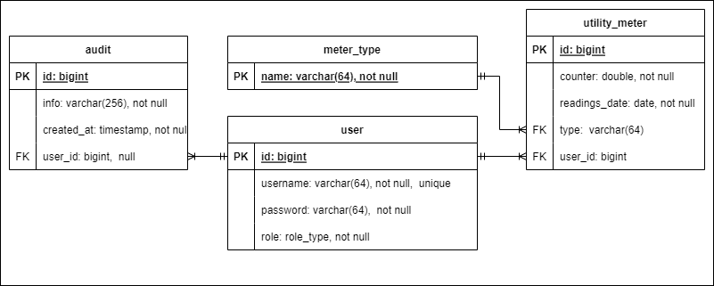

# Интенсив по Java Y_lab

# Веб-сервис для подачи показаний счетчиков отопления, горячей и холодной воды

## Запуск приложения

1. Клонируйте репозиторий: `git clone https://github.com/E6L1PS/monitoring-api.git`
2. Перейдите в директорию проекта: `cd monitoring-api`
3. Чтобы запустить тесты, выполните команду: `./gradlew test`
4. Если требуется, измените файлы конфигурации `.env`, `application.yml`.
5. Запустите контейнеры: `docker compose up --build -d`
6. Приложение будет доступно по адресу `http://localhost:8080/`
7. Регистрация `http://localhost:8080/auth/reg`
8. Аутентификация `http://localhost:8080/auth/login`
9. Эндпоинт показаний `http://localhost:8080/meter`
10. Эндпоинт типов показаний `http://localhost:8080/type`
11. Эндпоинт аудитов `http://localhost:8080/audit`
12. OpenApi Specification `http://localhost:8080/swagger-ui/index.html`

## Entity Relationship Diagram

## Используемый стек:

- spring-boot-starter-web
- spring-boot-starter-aop
- spring-boot-starter-jdbc
- spring-boot-starter-security
- springdoc-openapi-starter-ui
- springdoc-openapi-starter-webmvc
- JsonWebToken
- Docker
- PostgreSQL JDBC Driver
- Liquibase
- MapStruct
- Lombok
- Slf4j
- Тестирование:
    - Testcontainers для PostgreSQL
    - spring-security-test
    - spring-boot-starter-test

## Tasks:

1. [Task-1](https://github.com/E6L1PS/monitoring-api/tree/task-1) (Вводная)
2. [Task-2](https://github.com/E6L1PS/monitoring-api/tree/task-2) (JDBC. Миграции БД)
3. [Task-3](https://github.com/E6L1PS/monitoring-api/tree/task-3) (Сервлеты. АОП)
4. [Task-4](https://github.com/E6L1PS/monitoring-api/tree/task-4) (Знакомство с Spring Framework)
5. [Task-5](https://github.com/E6L1PS/monitoring-api/tree/task-5) (Spring boot)